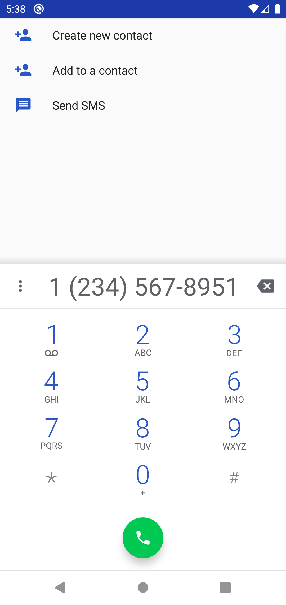
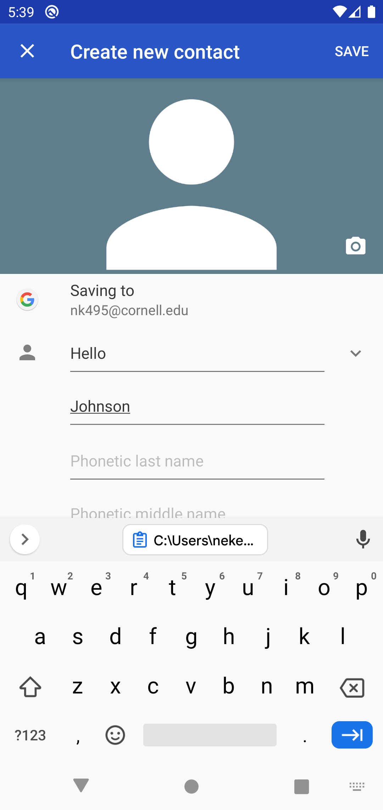
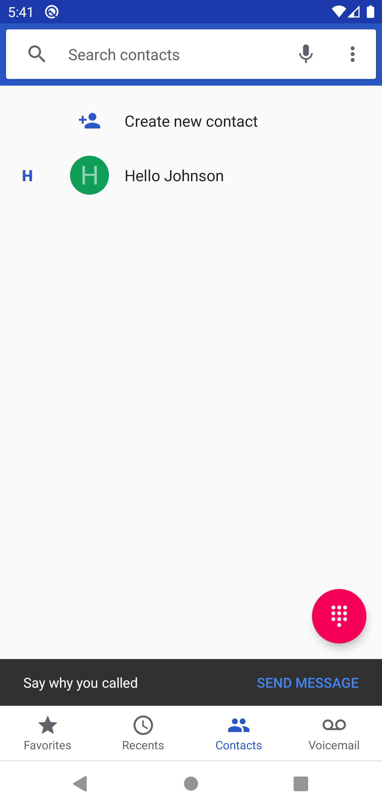
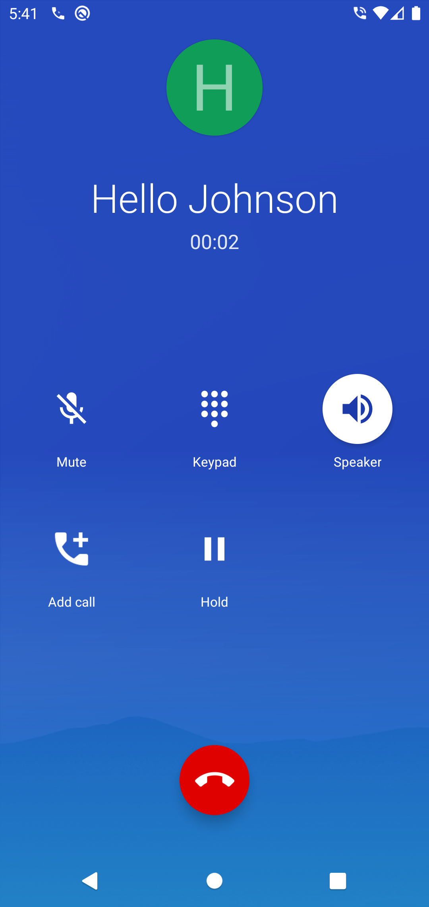

## Contacts

#### Opening the phone app

When you think of a phone, you think of calling people or sending them messages. Unfortunately, it might be hard to remember everyone's phone number all the time. Thankfully, your Android phone has an option to save phone numbers to your contacts! First, open you App Drawer and find the Phone app.

#### Adding a contact

As you can see there is an empty speed dial screen, and some buttons on the bottom for your favorites, recents, contacts, and voicemail. Favorites are people who you marked as favorite when creating their contact. Recents will have all the people you called recently and all the people who called you. Contacts will have all the people you saved to your phone. Voicemail will allow you to listen to your voicemails. To make a new contact, open the phone pad using the phone pad button and type in the phone number.

Once you type in the phone number, clock Create new contact and it will bring you to a new screen. Type in the person's name and hit save.

If you click on contacts, it will show you the person you just added.

#### Calling a contact

If you're already on the contacts tab from before, simply click on the contact and click call!

#### Calling without creating a contact

If you want to call a person without creating a contact, just open the phone app and type their number as before. Then click the green phone button and this will place a call!

