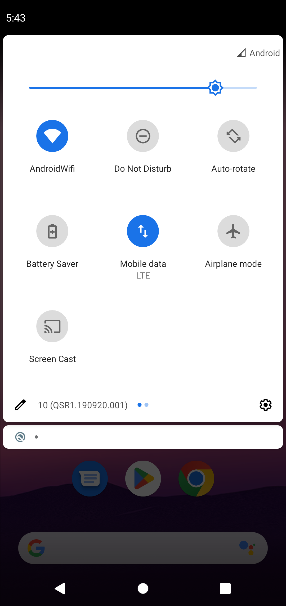
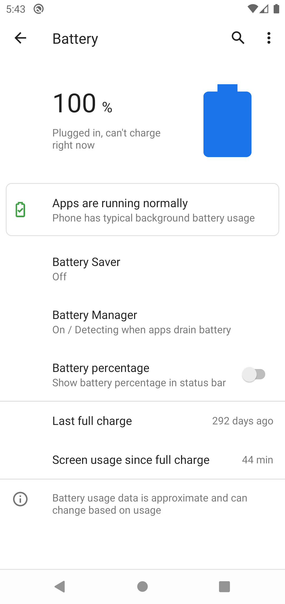
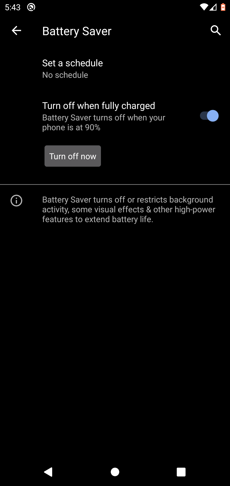
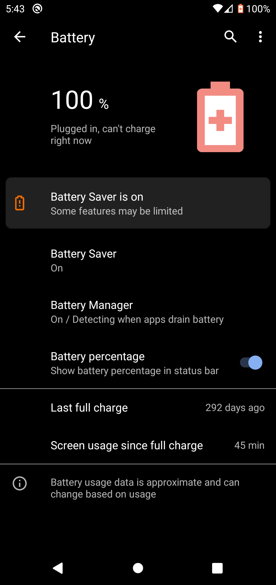

## Battery Saving

Do you feel like your phone is not lasting long enough? Maybe you wish your battery could be scretched a bit longer. Fortunately, Android has a feature that allows you to do just that! Navigate to your notifications tray by pulling down at the top of the screen and hold down on the battery saver button.

There will be a wide variety of options for you to enable battery saving. However, the most important one is the battery saver option. Tap on Battery Saver, and click Turn on now.

As you can see, battery saver has made your screen darker, which will save some battery. It will also make your phone run a bit slower which will help you save battery in the long run. You can feel free to return to these settings if you think you will want to turn this off.

