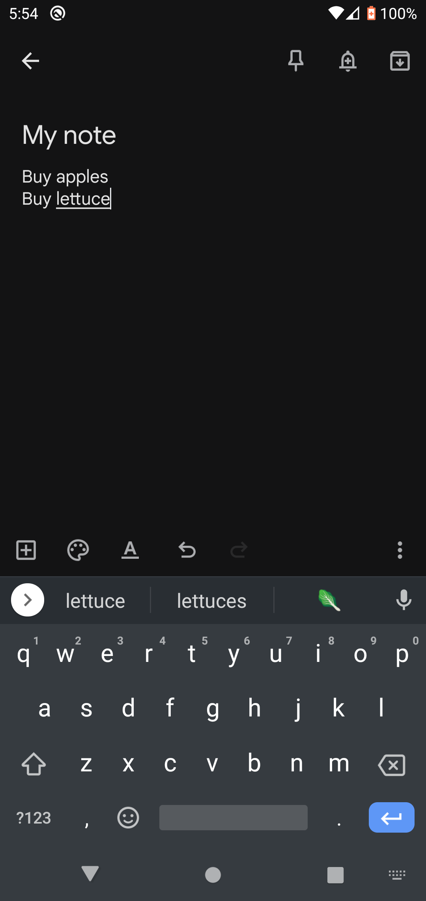

## Notetaking on your Android Phone

#### Downloading Keep

Sometimes, you want to take notes with you, but a physical notebook is too annoying to bring! Thankfully, your Android phone can get the ability of a physical notebook with the convenience of just bringing your phone! First, open the Play Store from your App Drawer.

After you've opened the store, type in keep into the top search bar, click search, and wait for it to appear in the list. Click on it once it appears in the list.

Once you've found the keep app, click install and wait for it to finish.

#### Creating a note

Go back to your home screen and find the Keep app either on your home screen or in the App Drawer. Tap on it.

After opening the keep app, click Get Started and you will see an empty screen. This will be the location of any notes you take. Click on the plus button and type in a note title and whatever you want inside the note. Then, click the back button.

When you've clicked the back button, you will return to the screen containing all your notes. You can make as many as you want! Grocery lists, book notes, and to-do lists are some examples of how you might use this.

