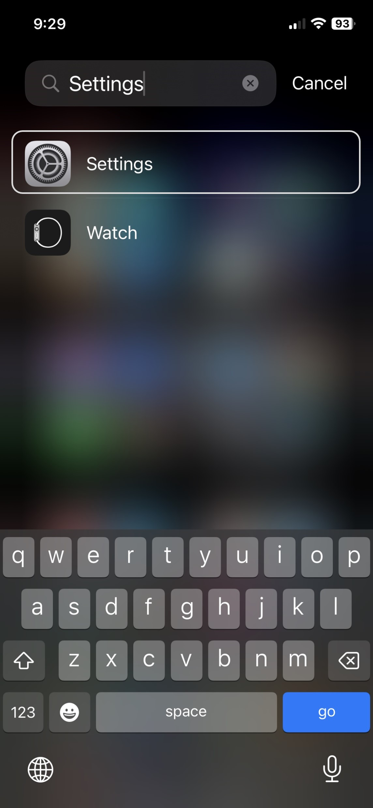
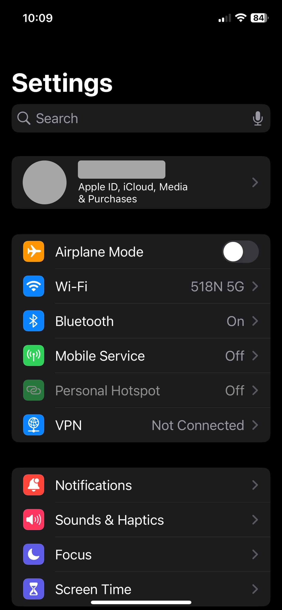
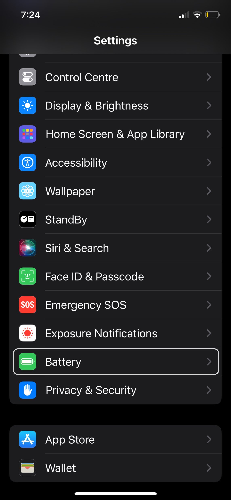
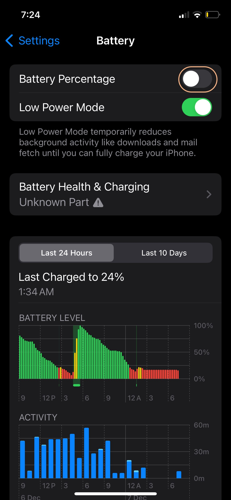
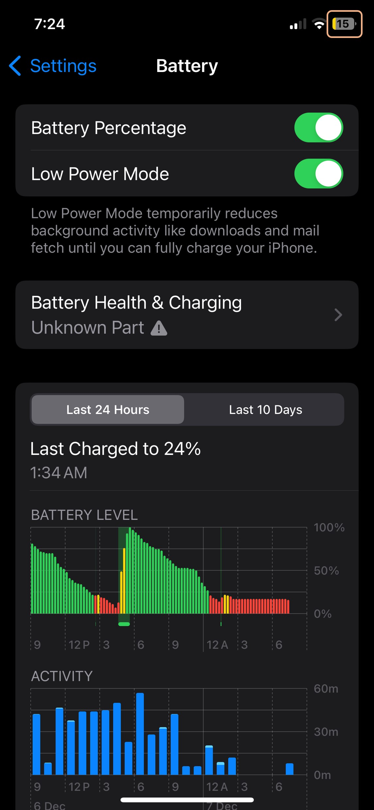

# View Battery Percentage

iPhones by default doesn't show the battery percentage numerically. You have to eyeball the battery icon at the top right hand corner and kind of guess how much battery you have left. However, just seeing a numerical value like 52% can make it easier to decide whether you should charge your phone or not. In this tutorial, we will show how to see the battery percentage on an iPhone in just a couple of clicks.

First, we need to go to the settings menu. To do this, keep on swiping to the right from the home screen and the last page you reach is the app library. The app library page will look like the image to the left. From here, search for 'Settings' in the top search bar and the settings app will come up in the result. Click on 'Settings'.

  

After opening settings, scroll down until you find 'Battery' section. Let's click on it.

  

Now, at the top you will see the 'Battery Percentage' option is currently disabled. Click on the toggle to the right (marked in orange) to enable this setting.

  

That's it! If you look at the battery icon at the top right hand corner, you will now see a a number on top of the battery icon. That's your battery percentage! Feel free to explore the settings menu on your phone to discover many other interesting features.
