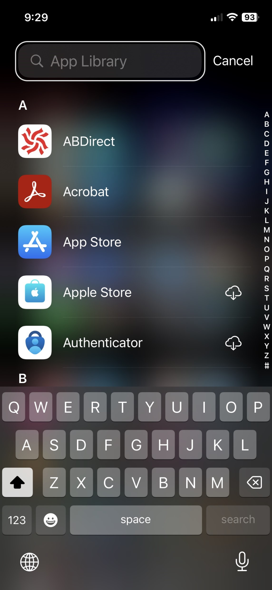
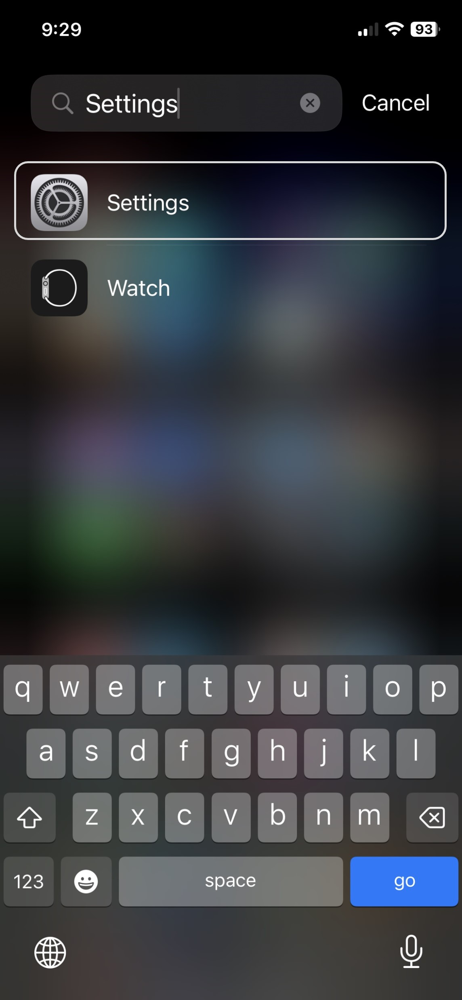
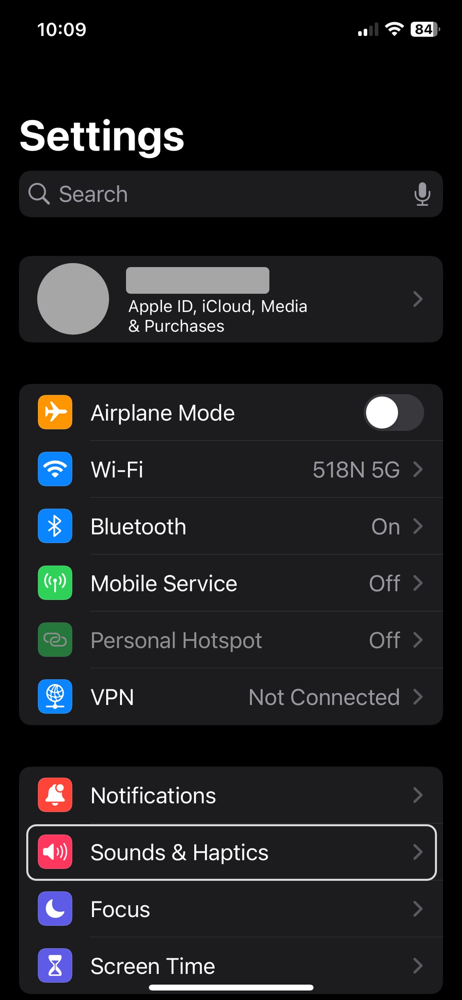
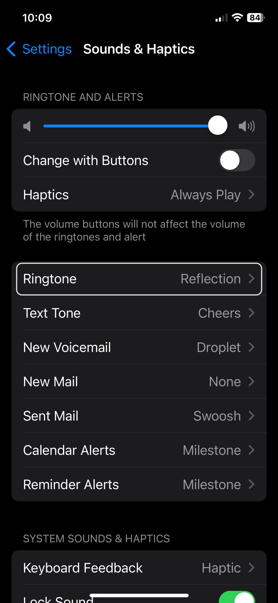
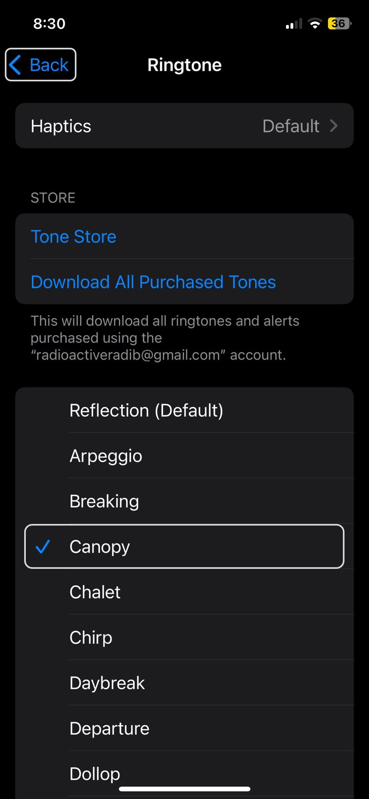
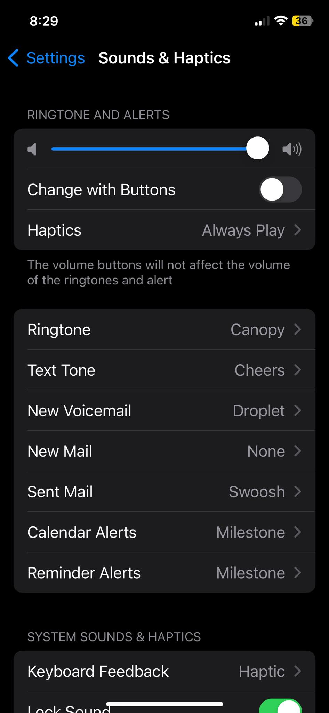
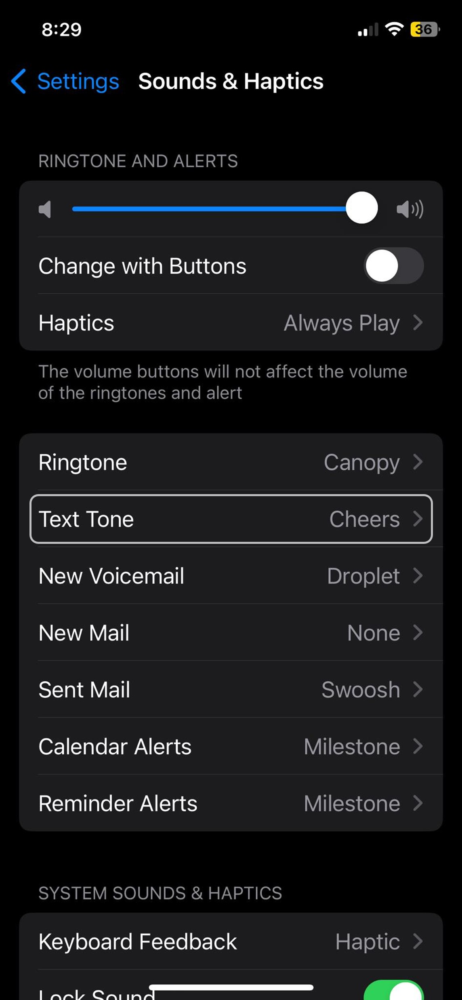
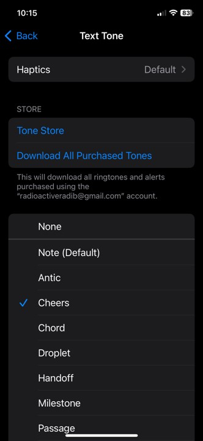

# Changing Ringtone

Hearing the same ringtone every time some calls can get boring over time. Smartphones now include many nice ringtones that you can switch to in just a couple of clicks.

First, we need to go to the settings menu. To do this, keep on swiping to the right from the home screen and the last page you reach is the app library. The app library page will look like the image to the left. From here, search for 'Settings' in the top search bar and the settings app will come up in the result. Click on 'Settings'.

  

After opening settings, click on 'Sounds and Haptics'. Now go to 'Ringtone'.

  

Here you will see all the ringtone options you have. Click on the name a ringtone to play it. The blue check mark to the left will be on the last ringtone you played. 

  

After playing some ringtones, we decided Canopy was a nice one to switch to. So, let's click on 'Canopy' to make sure the blue check mark is beside it. Now, if you click on the 'Back' button, you will see the ringtone has been changed to 'Canopy'.

We can also see in this page that we can change what unique sounds should play if we receive a  new text message, a voicemail, an email, etc. The process for changing these tunes is similar to changing ringtone. For a quick demo, let's see how to change the tune the phone plays when receiving a new text message. 

Go to 'Text Tone' and here you will see a many tunes to select from like before.

  

After playing some tunes, you can decide on which sound you like the most and then click the 'Back' button to change the tune. Make sure the blue checkmark is beside the tune you want to change to. Note that, there is also a 'None' option in cease you want the phone to be silent when you get a new message.

That's it! In just a couple of clicks, you can chnage the ringtone on your phone.
