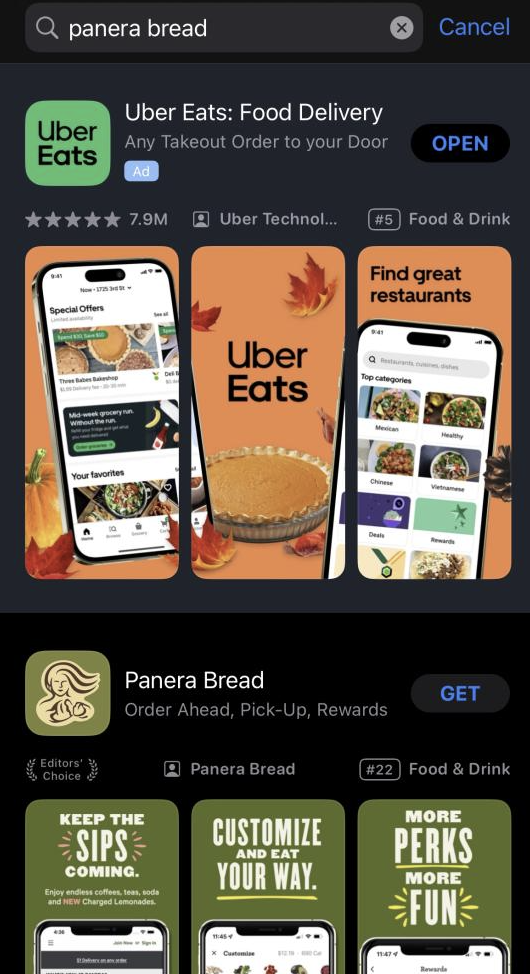

# The App Store

To get started, we will first learn how to download an app. The App Store is what allows us to do this. It has an icon like this: 

and comes preinstalled on every iPhone. 

First, locate the app. If you have not moved your apps around, it is likely on the first page. Opening the app will take you to the App Store homepage, which looks something like this: 

At the bottom of the screen, you'll see five icons: Today, games, apps, arcade, and search. Click on the search icon.

Now, at the top of the screen there should be a search bar. The page will look something like this. 

Here, you can type the name of the app you want, or a category of apps and games. Let's download the Panera Break app for this example. We'll type "panera break" into the search bar. You'll come to a screen that looks something like this. 

Click the "get" button next to the desired app to install the app. In some cases, you will need to scroll down to find the app you are looking for. 

You will be prompted to confirm your identity via face ID or your Apple ID password. A guide to setting up your Apple ID is [here](https://github.com/LunarEclipseCode/engrc-3500-team2/blob/main/content/iPhone/tutorial3-apple-id.md). 

After confirming, the download will start automatically. Once it is complete, the app will be displayed on your home screen, and will also be in your app library, for you to access. 

And that's it!
