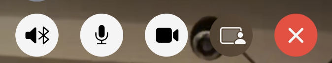
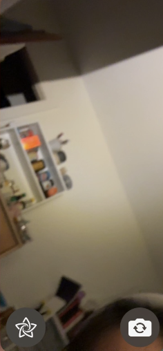

# FaceTime

## What is FaceTime?
FaceTime is Apple's built in video calling app. The icon looks like this: (insert image), and it comes preinstalled on all iPhones. The FaceTime icon looks like this: 

## Using the app
When you open the app, the screen will display your past FaceTime call history, and at the top there will be two buttons, create link and new FaceTime. "Create link" will generate a link that you can send to one or multiple people, and clicking on the link will start a FaceTime call. "New FaceTime" will prompt you to choose a person to call and directly start a FaceTime call. 

Once you are in a call, there are a few functions on screen. The top of the screen will look something like this:

From left to right, the buttons are:
- Sound output
- Mute
- Camera on/off
- Share screen
- End call

Sound output is where the sound is coming from, e.g. speaker or bluetooth device. Mute controls whether or not the person you are calling can hear you. It is default to unmuted, you can tap the icon to mute and again to unmute. The camera is default to on, so you can tap the button to turn it off, then again to turn it back on. 

If you want to share screen, you can tap the share screen button and select what app you want to share from, or if you want to share your entire screen.

The end call button ends the current FaceTime call.

There are also some buttons on the bottom of you screen. There is one in the bottom left corner, which can be used to take a picture of the screen (without the buttons on it, differentiating this picture from a screenshot). The other useful button is in the bottom right corner, where your video feed is. 

This button is used to change the direction of your camera. It is default to use the front facing camera, but you can switch it to the back camera by tapping the button, and back to the front facing camera by tapping it again.

