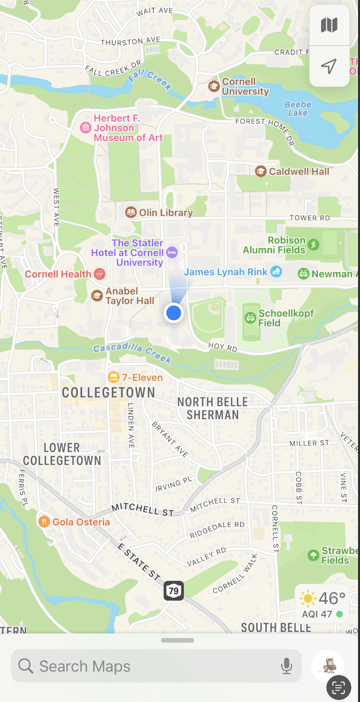
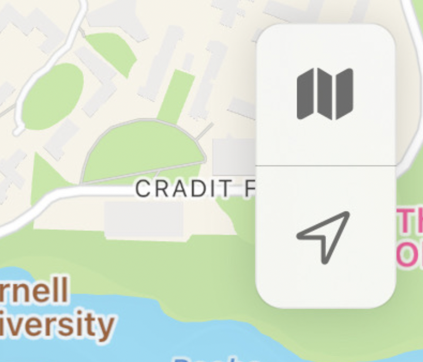
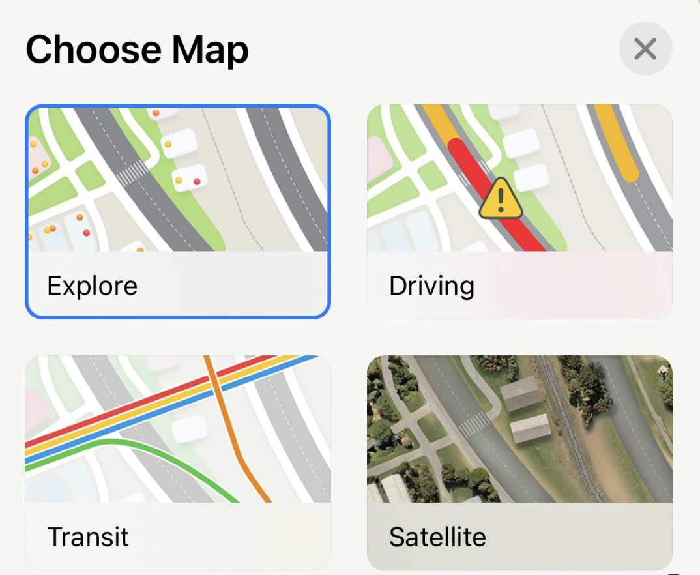
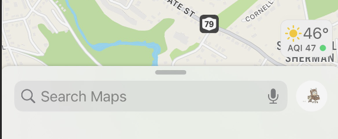
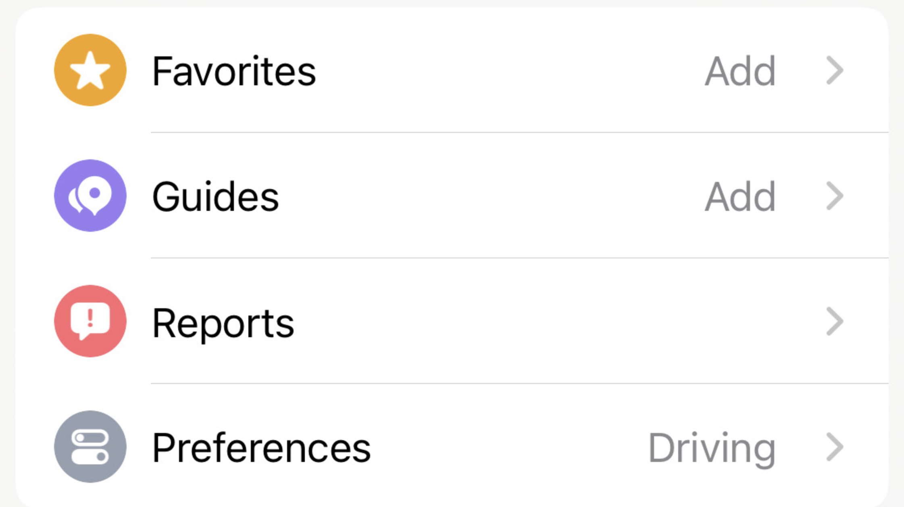
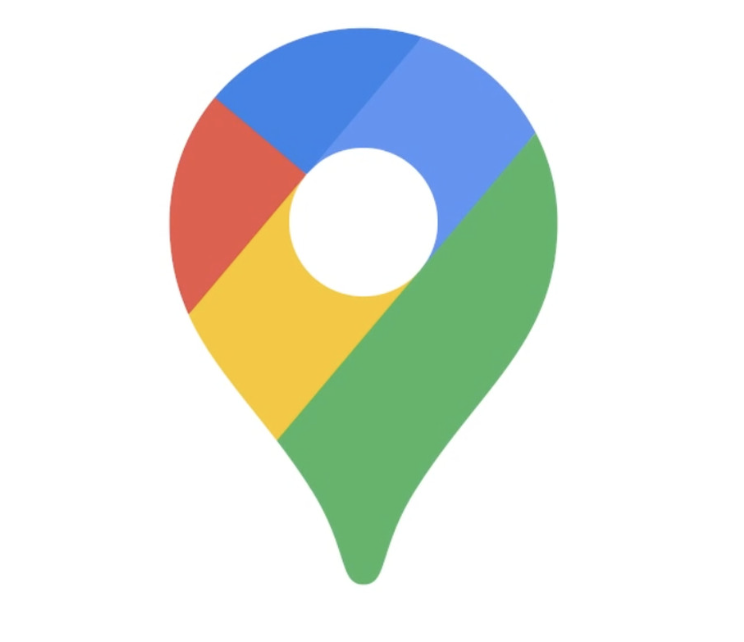
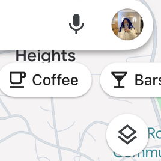
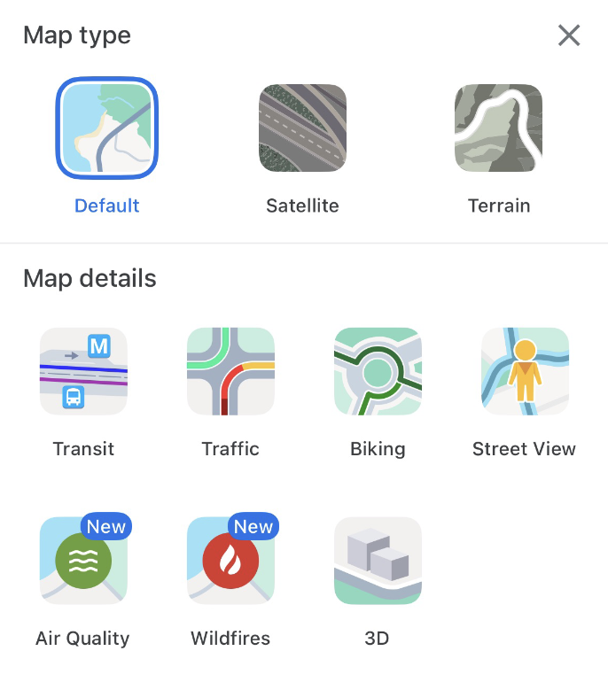

# Maps and Navigation

Here, we will learn about using maps for its various purposes. iPhones come with a built in Maps app, but if you would like to use Google Maps instead, follow [this](https://github.com/LunarEclipseCode/engrc-3500-team2/blob/main/content/iPhone/tutorial1-downloading-apps-iphone.md) tutorial to download Google Maps.

## Maps
### Basics
The app icon for maps looks like this: 

Upon opening the app you are greeted with a page that looks like this:

### Checking Traffic Conditions and Public Transit Schedules
At the top right of the screen, there is these buttons:

The bottom button is used to center your view of the map so that your current location is at the center of the screen. The top button is for changing your view of the map. If you click on it, it looks like this:

The standard display is "Explore", which is what you would use to search for locations. "Driving" allows you to check traffic conditions: red indicates heavy traffic, yellow is moderate, and green is none. "Transit" shows you the public transit lines that are around you. Tapping on a line will show how long until the subway/train/bus on that line arrives, and if there are any delays. 

### Setting Navigation Preferences
At the bottom of the screen, to the right of the search bar, there is a small profile picture icon. 

Click on that icon, it will then show this screen: 

You can set your preferences in the Preferences section. If you tap on "Preferences", it will give you options to select your preferred method of transit, options to show routes which avoid tolls or highways for driving, or avoid busy roads for walking. 

## Google Maps
### Basics
The app icon for maps looks like this: 

Upon opening the app, the screen looks very similar to the Maps screen:

### Checking Traffic Conditions
To check traffic conditions, you tap the small icon that looks like two squares on top of each other. The icon is towards the top right of the screen:

Tapping that icon leads to this screen:

Under "map details", you can select "traffic" to show traffic conditions. Dark red indicates very heavy traffic, red is heavy, yellow is moderate, green is none. 

### Checking Public Transit Schedules

In the same "map details" section as previously mentioned, you can click on "transit" to see details about the public transit lines in your area. Tapping on a specific line gives you details on its scheduled arrival and departure times. 
 
