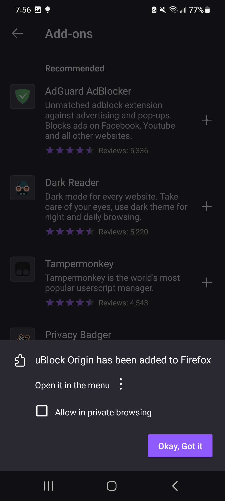

# Remove Ads on Website

These days many websites are infested with advertisements. The following post from Andy Budd summarizes the best the current state of browsing the web:

  

These ads not only reduces the web surfing experience, but also sometimes takes you to malicious sites if you accidentally click on it. According to a study conducted by Juniper research, 22% of all online advertising spending was for scam advertisements., which is translates to a whopping 84 billion dollars spent for fraudulent ads. [^1] You can avoid these scam ads in websites very easily by just using an adblocker.

There are other benefits to using adblockers too. Many people have limited mobile data plan, and blocking the ads from loading can save you a lot of mobile data. A study conducted by Ender Analysis found that the ad content in newspaper websites accounted for about 50% of the mobile data used to load the website. [^2] Not to mention, blocking the ads would also mean faster loading time for websites. 

You can install an adblocker in just a couple of steps. First, go to the list of apps on your phone and click on 'Play Store'. In play store, you will see a search bar at top.

  

In the search bar, type in 'firefox' and click on the blue search icon on the keybaord (at the right most corner). Now click on 'Install'.

  

Now firefox will start downloading. Once the downloading and installation process is complete, the 'Install' button will turn into an 'Open' button. Click on 'Open'.

  

When you open firefox, it will ask some questions to help the setup process of the app. Just click on 'Not now' for all three of these questions. When you click on 'Not now' for one question, the app will automatically take you to the next question.

  

When you click on 'Not now' for the final question, it will take to the homepage of firefox. Also, the app will not ask you these questions again. It's just when you launch the app for the first time on your phone.

Now, click on the three dots at the top right corner, and then click on 'Add Ons'.

  

Now click on the plus button beside uBlock Origin. This is the extension that will block all the annoying ads and popups and make you web experience much better. Wehn you click on plus, the app will ask you if you want to add 'Ublock Origin'. Click on 'Add'.

  

It will take couple of seconds to download ublock origin. Once finished, the message in the left picture will show up. Check the box beside 'Allow in private browsing' and click on 'Okay, Got it'.

  

That's it! You have done it! 

[^1]: “Ad Fraud Stats,” Business of Apps. Available: https://www.businessofapps.com/research/ad-fraud-statistics/
[^2]: L. O’Reilly, “Ads on news sites gobble up as much as 79% of users’ mobile data,” Business Insider. Available: https://www.businessinsider.com/enders-analysis-ad-blocker-study-finds-ads-take-up-79-of-mobile-data-transfer-2016-3