# Blue Light Filter

If you pass in sunlight through a prism, the light will be spread out into a rainbow. Here, we can see the presence of blue light in sunlight. Blue light contains more energy 

  

than other colors of light. However, as sun is so far away from away from us, the blue light in sunlight is not a concern. However, what is concerning is the blue light emitted from digital screens like smartphone, laptops, etc. As these devices are typically used really close to our eyes, longtime exposure to digital screen can cause eye strain, blurred vision, and headaches due to the emitted blue light. 

Blue light can also reduce the production of melatonin, the hormone responsible for making us sleepy. So, using smartphone for hours before going to sleep can make it difficult to fall asleep. Thankfully, most smartphones come with blue light filter these days. Enabling this feature will give the display a brownish tint and reduce the amount of emitted blue light.

On Samsung phones, to enable blue light filter, First, go to the Settings menu by either clicking on the gear icon or scrolling down on your home screen and clicking on the top right hand corner.

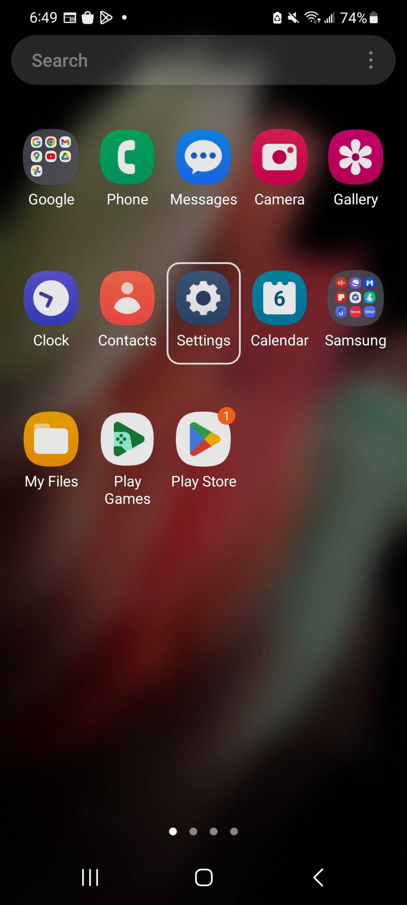
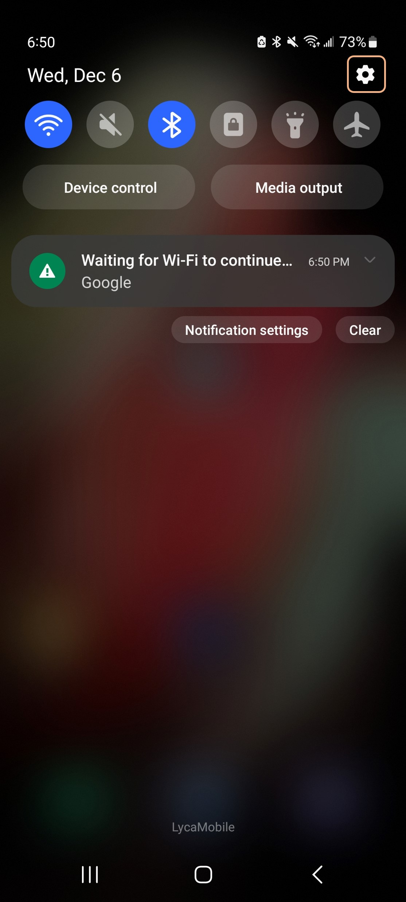
  

After opening settings, scroll down until you find 'Display' and click on it.

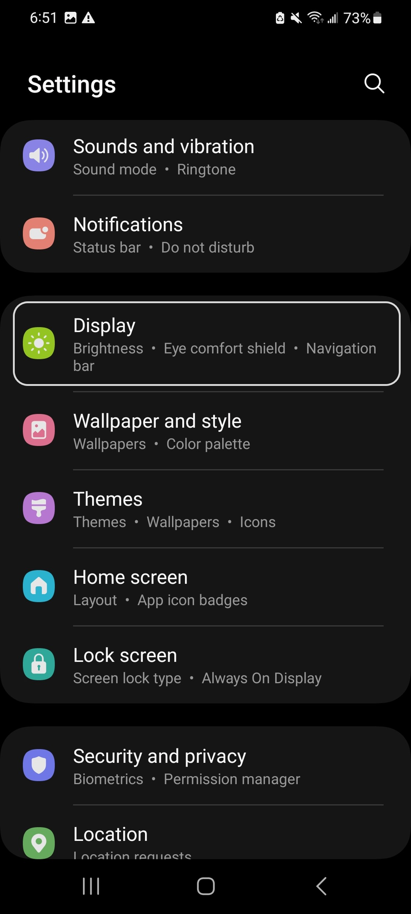
  

Now, you will see a option called 'Eye Comfort Shield'. Click on it. It will take to this new image shown to the right.

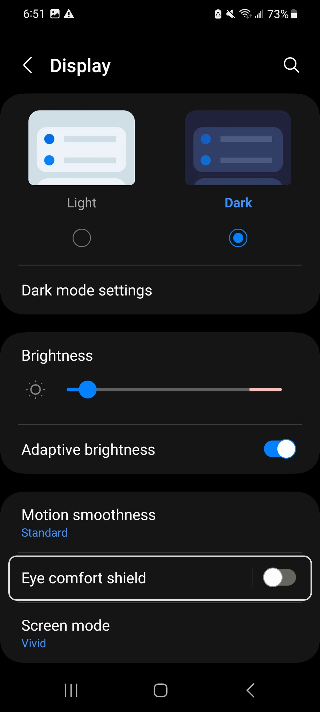
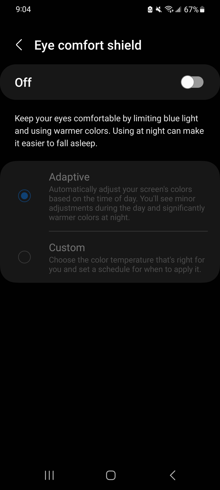
  

Now, you can click on the toggle in the top right corner to enable the the blue light filter. When it's enabled the toggle will change color. By default, the feature will be in adaptive mode. In this mode, the blue light filter will take into effect at night to reduce eye strain and help you fall asleep. You can also set which time of the day you want to have blue light filter by clicking on the 'Custom' option.

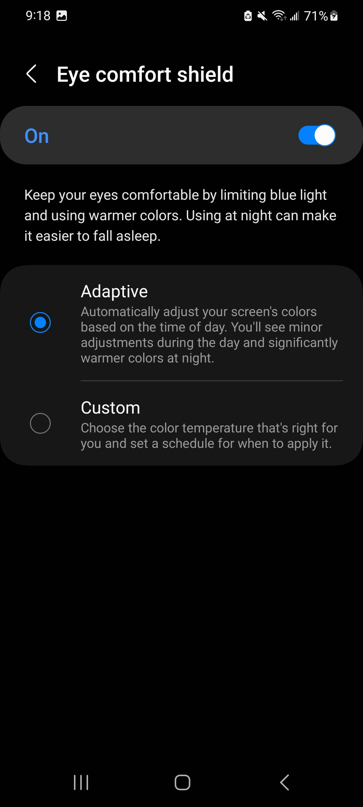
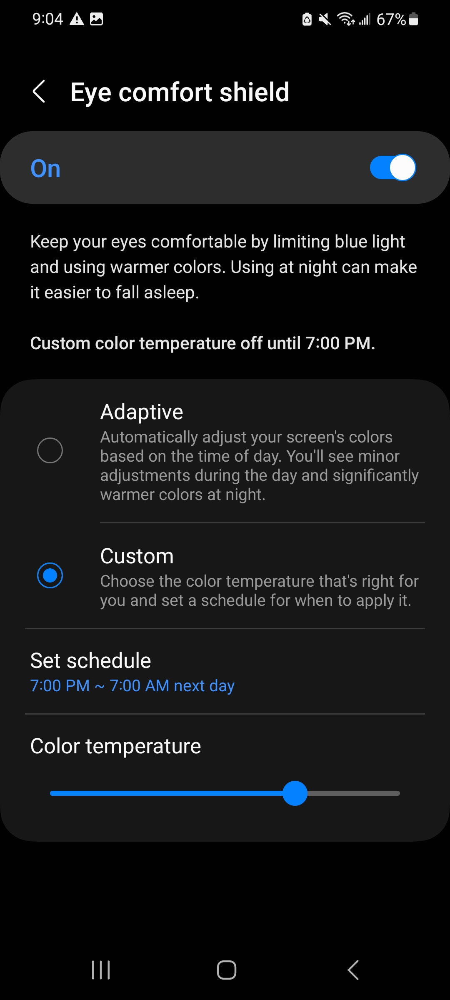
  

Under custom mode, you can change how much brownish tint you want by moving the 'Color Temperature' slider at the bottom. To change when this feature is in effect, you can click on 'Set Schedule'. Here you will have three options. 

* You can keep blue light filter / eye comfort shield always on.

* Only enable it from sunset to sunrise.

* Set your own time by clicking on the 'Custom' option.

If you click on 'Custom', you can set the start and end time of this feature and then click on 'Done'.

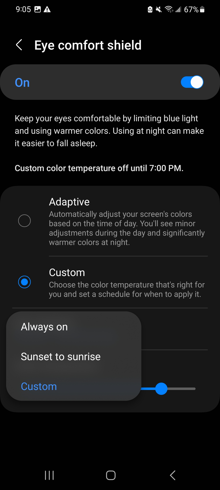
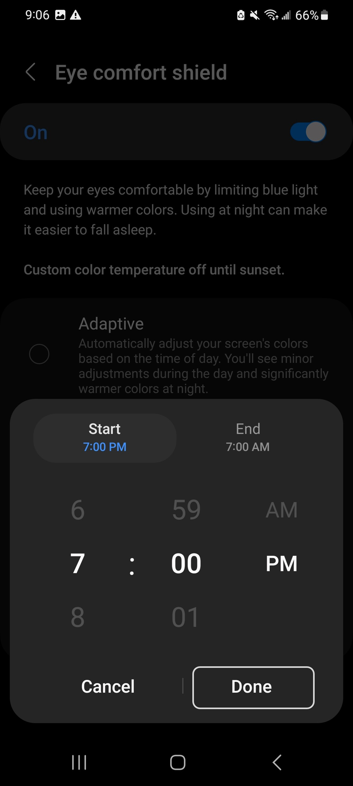
  

If you click on 'Sunset to sunrise', the phone will ask you for location permission because it needs to know when is sunrise and sunset at your current location. Click on 'While Using the app'. This will take you to a new page. You don't have to change anything here. Just click on the back button at the top left to go back.

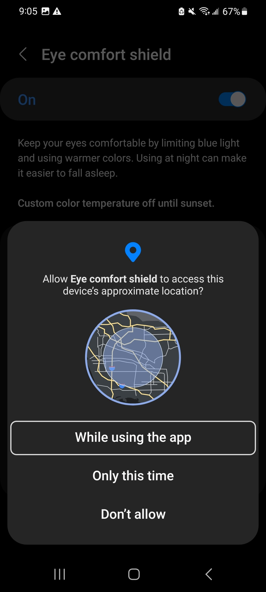
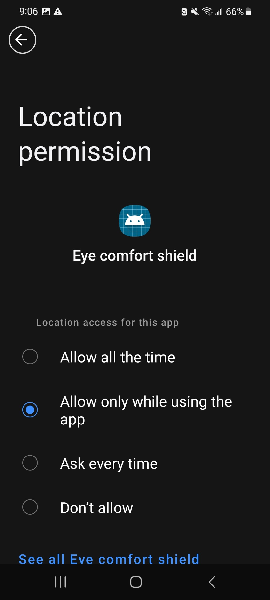
  

There is also a simpler way to enable blue light filter, but in this way you can only turn on or off the blue light filter, you cannot customize how long the filter should be enabled or how much tint you want on the screen. For those configuration, you still have to follow the process we just discussed.

To enable eye comfort shield / blue light filter easily, just scroll down from the top twice, to bring the quick settings menu. Here, you will see the 'Eye Comfort Shield' option somewhere. Click on the circle, to enable the filter.

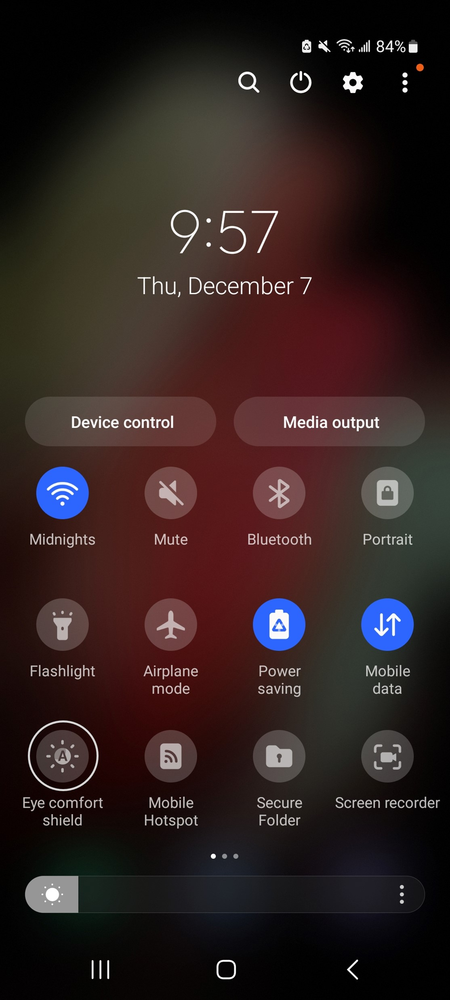
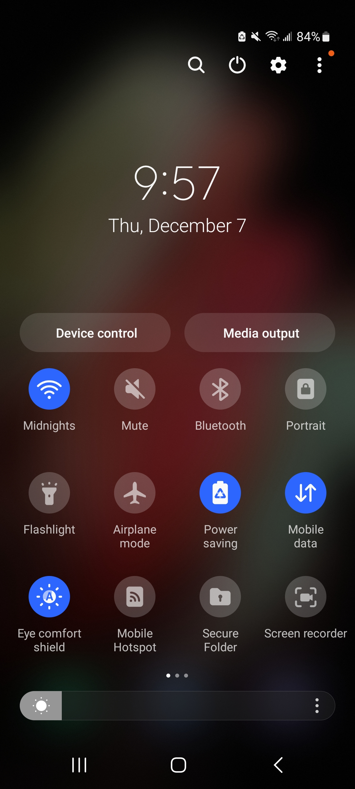
  

Congratulations! Now you know all there is to blue light filter. Feel free to explore the settings menu on your phone to discover more interesting features. 
