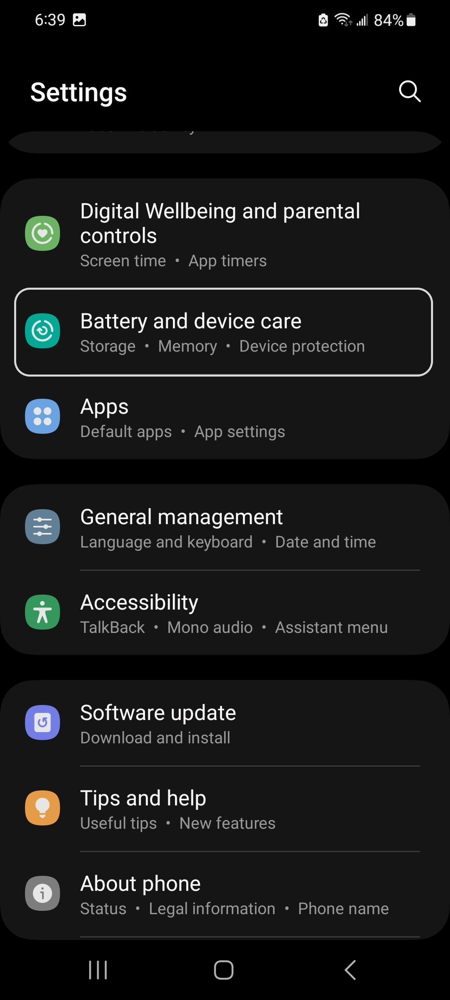

# Maintenance Mode

If you ever need to take your phone to a repair shop, chances are they will ask to you to leave the phone for a couple of days while they diagnose the problem, find replacement parts, and fix your phone. But after they have fixed the phone, they might need access to the phone to check everything is working properly. But for privacy concerns, you probably don't want the repair person to have access to your sensitive information like contacts, messages, google account, etc. So, how do you give someone access to basic functionalities of your phone while blocking access to personal information?

For such purposes, maintenance mode comes to the rescue. In this mode, the repair shop cannot access your contacts, messages, apps, accounts, and other files like pictures, music, and downloads. The repair person will still have access to settings menu and all the pre-installed apps i.e. applications that were already on your phone when you first bought it. After the repair shop gives back your phone, you can just enter the phone's password to get back to normal mode. Moreover, when you switch from maintenance mode to regular mode, all apps installed or files downloaded by the repair shop will be removed.

### Switching to Maintenance Mode

You can switch to maintenance mode in just a couple of steps. First, go to the Settings menu by either clicking on the gear icon or scrolling down on your home screen and clicking on the top right hand corner.

  

After opening settings, scroll down until you find 'Battery and device care' and click on it.

  

Now you will a page with summary of how much battery left, how much storage you have used, and other deatils. Scroll down in this page and at the bottom, you will see 'Maintenance mode'. Let's click on it.

  

Now, to switch to maintenance mode, click on 'Turn on'. It will popup a new message and here click on 'Restart'. You need to restart your phone to switch to and exit out of maintenance mode.

  

 The phone will take about 2 minutes to create the log and then restart. To avoid the wait, you can also enable 'Restart without creating log' before clicking 'Restart'.

  

### Inside Maintenance Mode

After restart, you will in the left corner, the phone telling that you are in maintenance mode. In the list of apps, we can only see apps that was already on the phone when we first bought it.

  

Now if someone tries to see message, we can see the phone is blocking access to it. Also, in contacts, the repair shop will only see your phone number.

  

Moreover, if we go to 'Downloads' folder, the phone will show its empty. Going into email, we can verify that the repair shop does not have access to your gmail.

  

### Exit Maintenance Mode

To exit this mode, scroll down to see the notifications. Here you will see 'Your phone is in Maintenance mode. Tap here to exit', Let's click on it. Now, in the new page, click 'Exit'.

  

It will now show a confirmation popup. Click on 'Restart'. The phone will then ask for your password/unlock pattern. After entering your password, the phone will restart and you will be back to normal mode.

  

Congratulations! Now, you know all about maintenance mode.
