# Mobile Hotspot

Mobile hotspot is a feature to share the internet from your phone with other devices. This can come in handy in various situations:

* Let's say your home internet is currently down due to scheduled maintenance from the service provider. However, you cannot miss the team meeting over zoom today. In such scenario, you can create a hotspot from your phone to share your mobile data with other devices. When mobile hotspot is enabled, it will show up as a wifi network on other devices and you just enter the password to access the wifi.

* Let's say you are on a road-trip with your friends and in a remote area, your friend's phone is not getting good cell reception and as a result, Google Maps isn't working. If your smartphone is getting decent internet connection in that area, you can share your internet via hotspot with your friends.

In this tutorial, we will show you how to create a mobile hotspot in one minute.

First, go to the Settings menu by either clicking on the gear icon or scrolling down on your home screen and clicking on the top right hand corner.

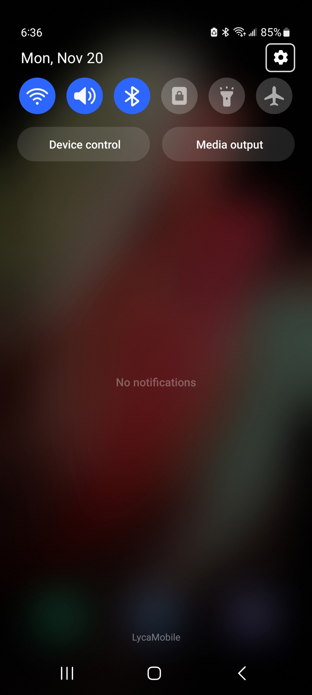
  

After opening settings, click on the 'Connections' tab. From there, click on the 'Mobile Hotspot and Tethering' tab at the bottom of the screen.

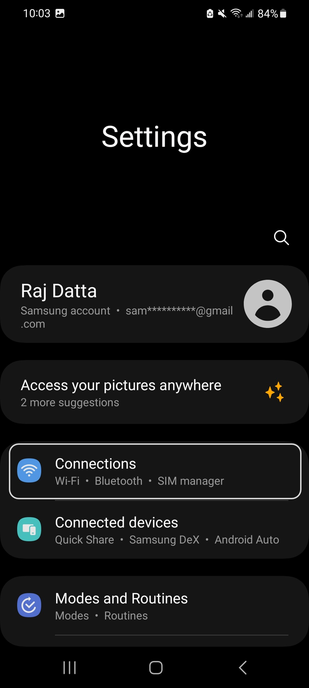
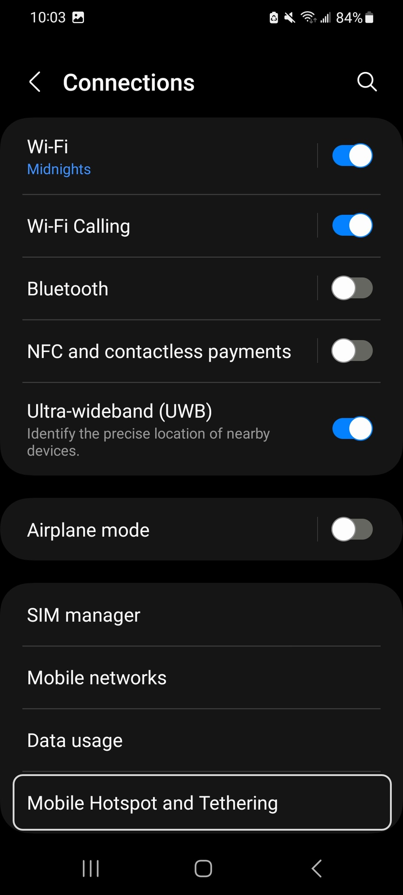
  

From here click on 'Mobile Hotspot'. This will take you to a new page where you can click on the toggle (marked in orange) to enable the hotspot. However, before turning on this feature, let's explore some settings associated with mobile hotspot. To see these settings, click on 'Configure'.

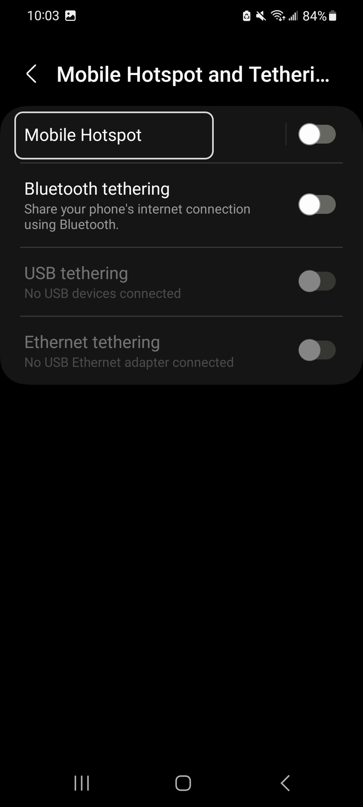
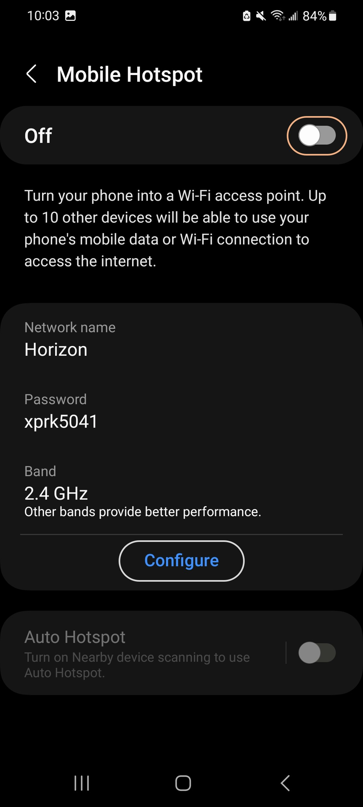
  

Now, here under 'Network Name', you can set whatever name you want. This will be will be the name of the wifi network created by the phone once hotspot is enabled. Next, you can set the password to access the phone's hotspot. We recommend a password that has capital letter, small letter, numbers, and some punctuation symbol. 

However, what we are more interested in is the other options. If you click on band, you will have the option to choose between 2.4 GHz and 5 GHz. The simple difference between these two bands is 5 GHz will provide higher internet speed than 2.4 GHz but it has shorter range compared to 2.4 GHz. Choose whichever option you like but we think 2.4 GHz provides enough speed for all tasks.

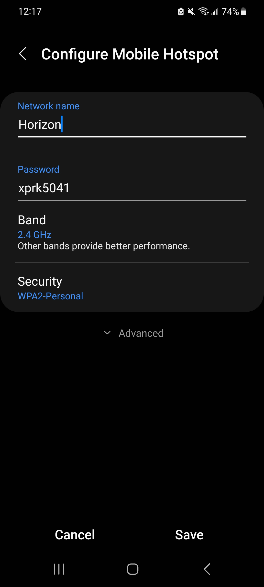

  

Next under security, you have the option to choose between WPA2, WPA2/WPA3, and WPA3 protocols. In simple terms, WPA3 is more secure than WPA2. However, as WPA3 is a recent protocol, many older devices cannot connect to hotspots that only supports WPA3. Moreover, if you enable WPA2/WPA3, that doesn't provide any extra security compared to just using WPA2. In fact, some older devices can still have problems connecting to the hotspot if it's WP2/WPA3. So, make sure to keep the 'Security' set to 'WPA2-Personal'.

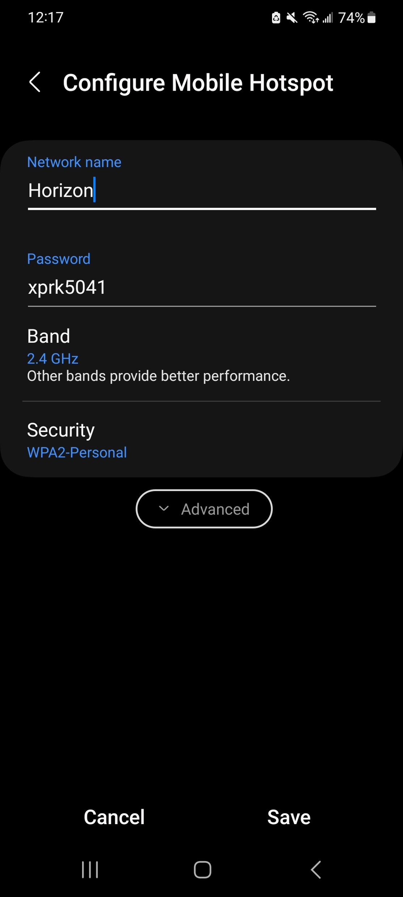
  

There are also some important settings under 'Advanced' that we should discuss. So, let's click on the 'Advanced' button. Now first off, we should change the 'mobile data limit'. Basically, if you set this limit to 5 GB, then after the devices connected to your hotspot has spent 5 GB in total, the hotspot will be disconnected. Many carriers have limit on how much hotspot you can use per month, so you should contact your carrier and set this limit accordingly.

Now, when you click on 'Set mobile data limit', a new box will popup where you can enter the limit. 

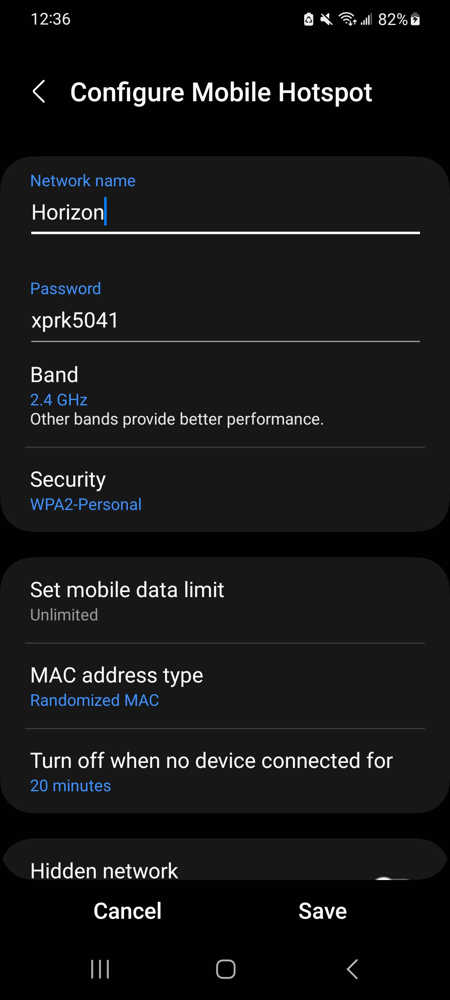
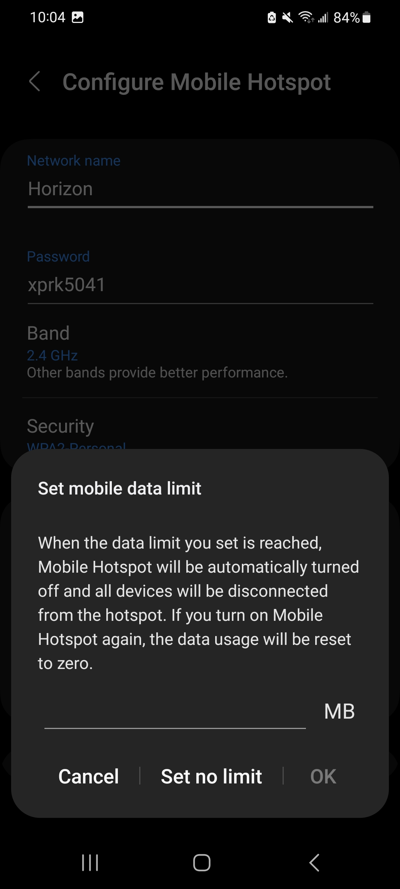
  

For our case, we want the limit to be 5 GB, so let's enter 5000 MB and click 'OK'. Now, you will see the limit has been set to 4.88 GB. (It's 4.88 GB and not 5 GB is because 1024 MB = 1 GB)

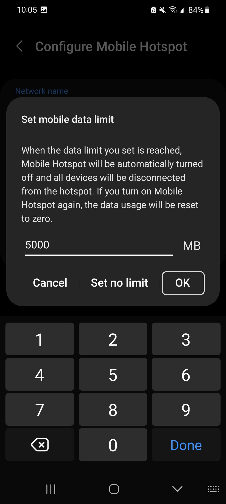
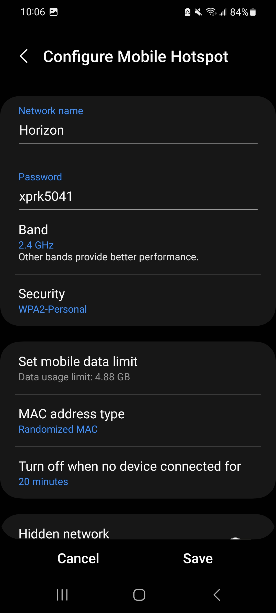
  

Now, for MAC address type, you have the option to choose between randomized MAC and phone MAC. You should always select randomized MAC to increase privacy and security on your hotspot. Finally, you also have an option to set a timeout period. If no devices are connected to your hotspot after this amount of time, then the hotpsot will be turned off.

  

If you scroll down in this page, you will see other advanced settings but we recommend not to change these. So, now that we are done configuring our hotspot, let's click on the 'Save' button. This will take us back to out original mobile hotspot page. Now we can click anywhere on the grey capsule (enclosed in orange) to enable the hotspot.

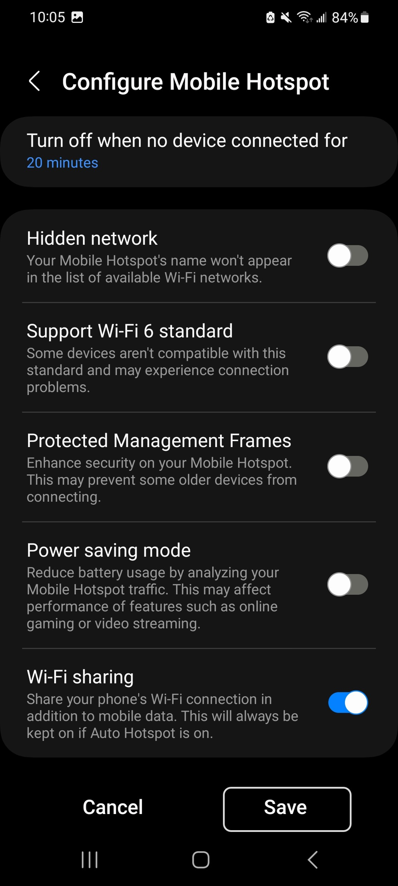
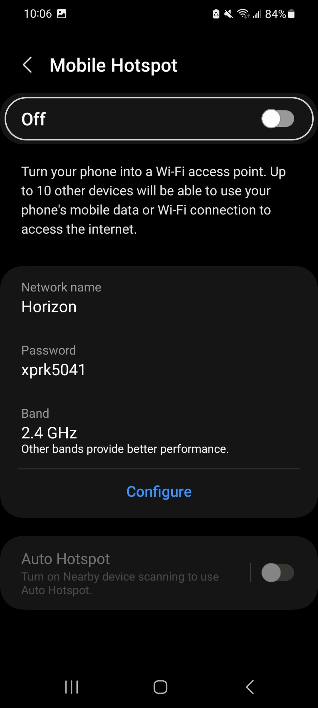
  

Once the hotspot is on, you can use the phone's internet by using the password or scanning the QR code. The QR code can be found by clicking on 'QR code' at the bottom left. 

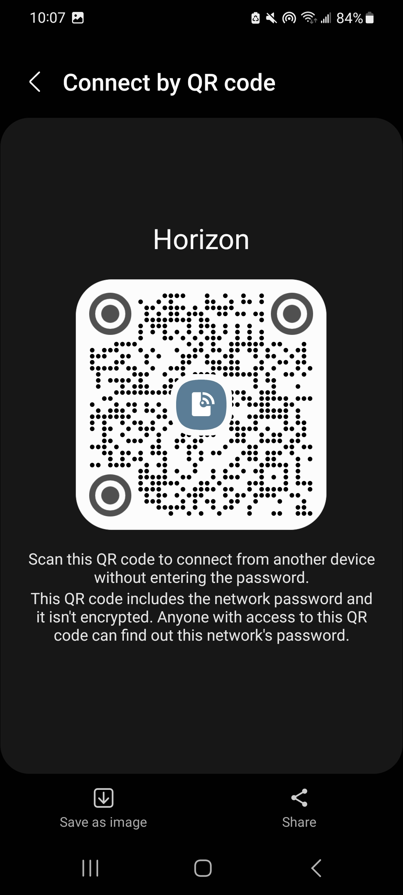
  

Finally, once a device has connected, you can see that device by scrolling to the bottom of the 'mobile hotspot' page. If you see a device that you don't recognize, immediately disconnect your hotspot and change the password.

  

Congratulations! Now you know everything about mobile hotspot! Feel free to explore the settings menu to find many other interesting features in smartphones!
