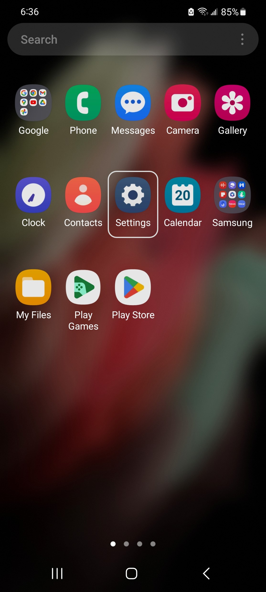
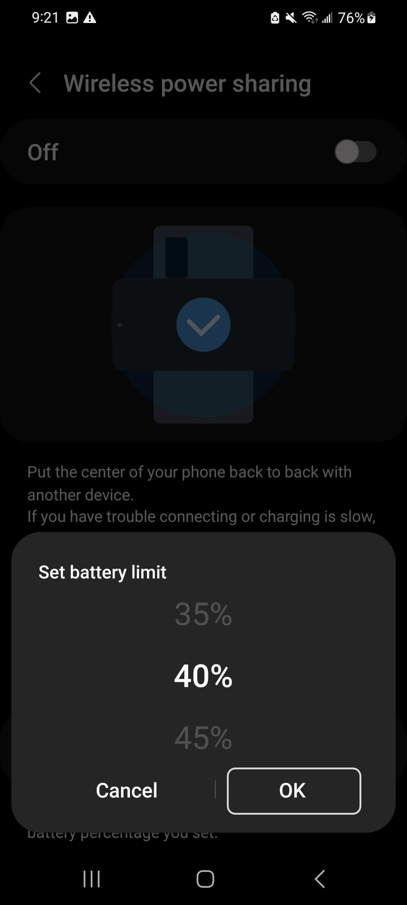

# Reverse Wireless Charging

Reverse wireless charging allows you to charge other smartphone, smart watch, or earbuds that supports wireless charging. Many devices these days has wireless charging, but reverse wireless charging is is less common among smartphones even though it was first introduced in 2018,. This feature can be very helpful in emergency situations when you are out on a tour and one of your friends has forgot their charger. In such scenario, you can just place your phone upside down, and put your friend's phone on top it to charge. 

Reverse wireless charging is called by different names based on the smartphone brand. For instance, on Google Pixel, this feature is called 'Battery Share' while on Samsung devices, it's called 'Wireless Power Share'. You can enable this feature in just a few clicks on your Samsung phone.

First, go to the Settings menu by either clicking on the gear icon or scrolling down on your home screen and clicking on the top right hand corner.

  

After opening settings, scroll down until you find 'Battery and device care' and click on it.

  

Now click on the 'Battery' section. This will take you to a new page where you can see more details about your battery.

  

Scroll down to the bottom of this page and click on 'Wireless power sharing'. In the new page, there is an animation and also instructions on how to wirelessly charge other devices using your smartphone. 

  

Before enabling this feature, you can click on the Battery limit option at the bottom to set a bound on your battery percentage. When your are charging some device using your phone, of course your device will loose charge. If your battery limit is set to 30%, then your phone will automatically stop charging the other device when it hits 30%. You can change this limit by clicking on 'Battery limit'.

  

After setting the limit, you can click 'OK' for the change to be in effect. Now, you can click on the toggle in the top right hand corner to enable wireless power share. When it's enabled, you will also see a 'Ready to charge' message on your screen. Note that you cannot enable wireless power sharing while it's charging. If you try to enable it, in will show you a message (in the image to the right).

  

Congratulations! Now you can help that one friend who forgets to bring their charger! There are so many other interesting features in smartphones these days! Feel free to explore and discover them. Stay curious!
