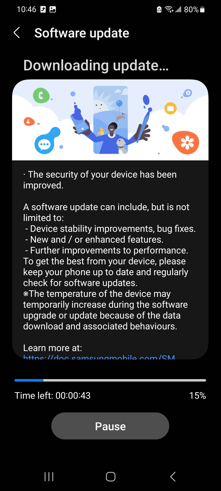

# Software Update

There are basically two forms of update in a smartphone. You can update your installed apps to get new features, better user experience, and to resolve potential issues you might have experienced with that app before. You can also update the overall software that's currently running on your phone. These second form of updates can be placed into two categories.

* **Security Patches**: These are small updates that fixes underlying security vulnerabilities of your smartphone. These updates usually don't add new features but they are still very important. For example, the December 2023 security patch for Android fixed 94 security vulnerabilities. [^1] Hackers are always trying to take advantage of these security issues to steal your personal information and so you should install these updates as soon as they are released.

* **Android Version Update**: This is the major yearly update that adds lot of new features to your smartphone and improves the overall user interface. Most companies still offer only 2 years of Android version updates, however brands like Samsung and Google has recently started offering 4 years of Android version updates since the phone's release.

We will now go over how to keep you apps and software up to date. 

#### Updating Installed Apps

First, go to the Play Store and then click on your profile picture in the top right hand corner.

  

Now . It will open a new menu. Go to 'Manage apps & device'. From here, click on the 'Updates Available' section.

  

Now, you will see a list of all installed apps for which updates are availble. You can click on the 'Update' button to the right of any specfifc app to update only that app. Also, you can just click 'Update All' button in the top right corner to start updating all the apps.

  

Note that updating all apps can take some time depending on how many apps you need to update and the internet speed. However, you can just use your phone for other task while the apps are updating in the background. Also, if you want to stop the update process at any point, you can just click 'Cancel All'.

That's all there is to it regarding updating apps on your phone. Let's now see how to update the overall software on your phone.

#### Installing Software Update

First, go to the Settings menu by either clicking on the gear icon or scrolling down on your home screen and clicking on the gear icon in top right hand corner.

  

After opening settings, scroll down until you find 'Software update' and click on it.

  

Now click on 'Download and install' section. The phone will take couple of seconds to check if there is any available software update. If there is no available update, you will see a message saying your phone is up to date.

  

However, if an update is available, the phone will start downloading it. Once the download process has finished, it will give you option to schedule the installation or install it right now. Make sure your phone has enough charge before clicking 'Install Now'. We recommend having at least 50% charge before you start updating the phone.

  

Now, the phone will restart and take some time to update. Your phone might even restart multiple times during the update process. The progress bar during update will look like the image below. 

  

The main point is don't click on the power or volume buttons during the update process. Just wait until the phone shows the lock screen and congratuations! You have successfully updated your phone.

[^1]: “Android Security Bulletin—December 2023,” Android Open Source Project. Available: https://source.android.com/docs/security/bulletin/2023-12-01
