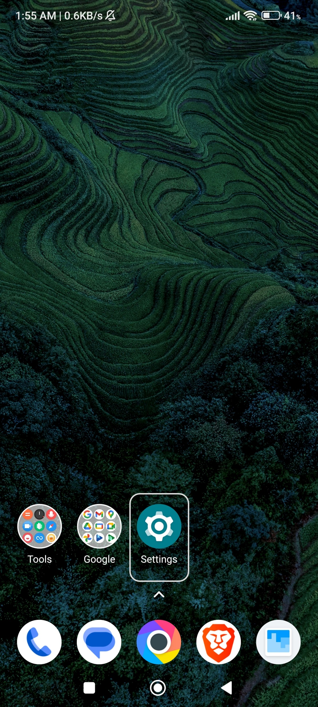
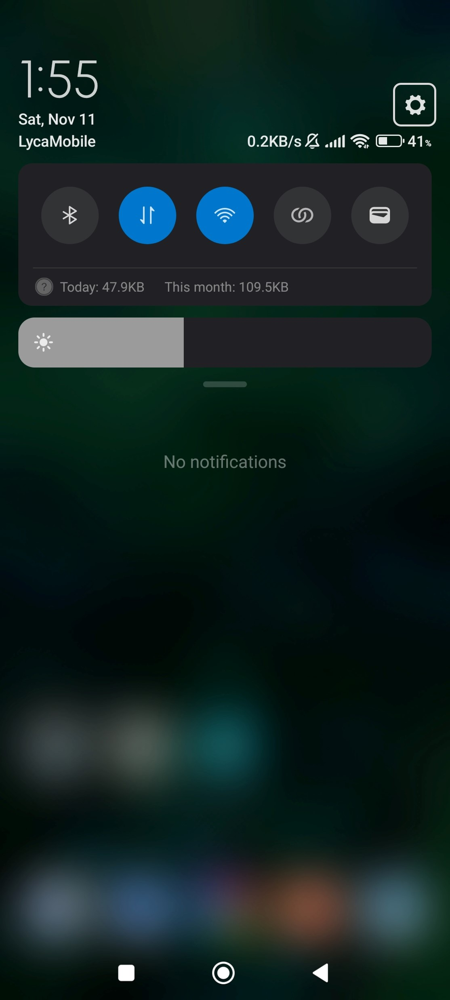
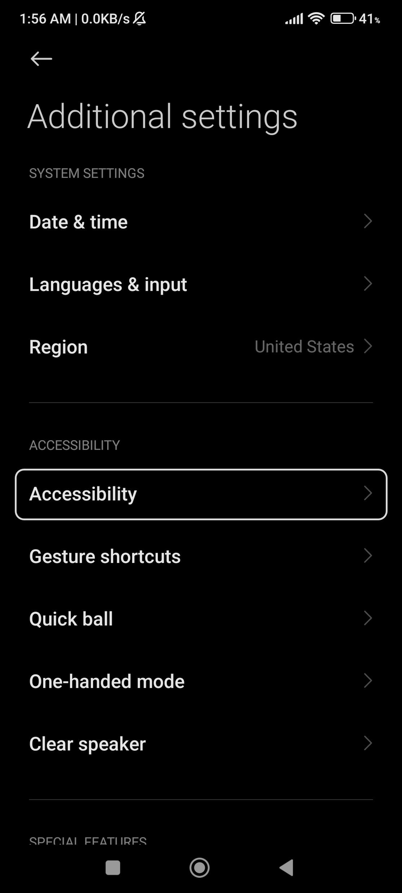
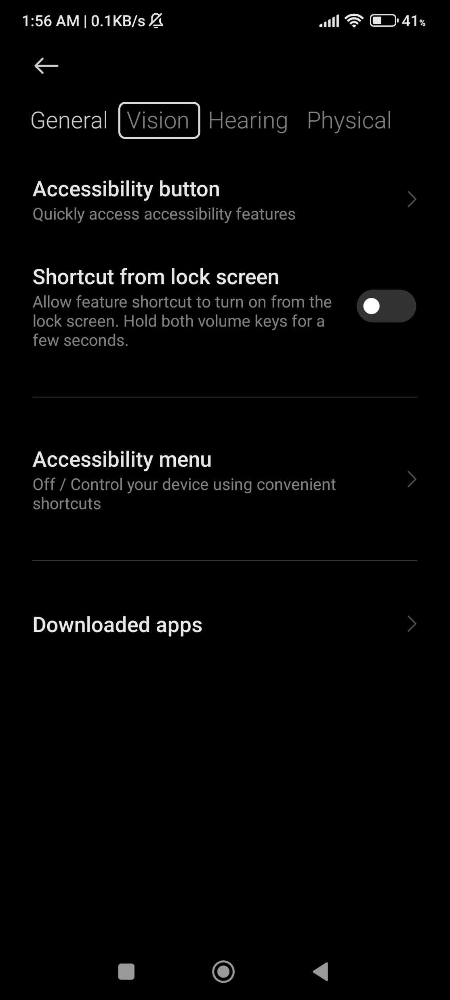
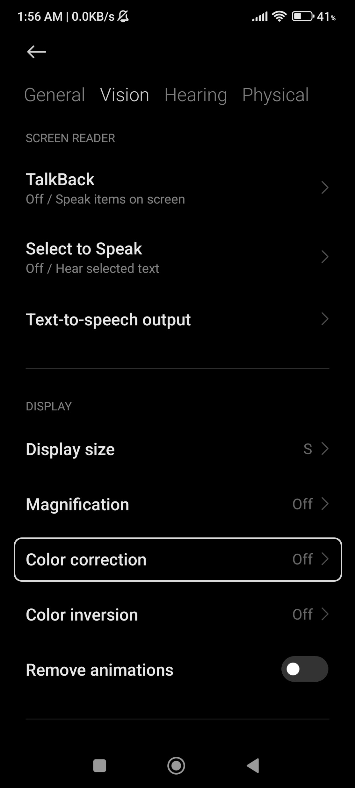
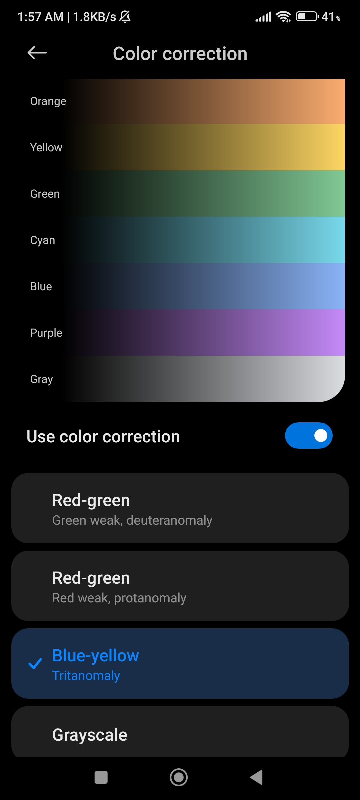

# Color Blind Friendly Mode

Colorblindness is more prevalent than people might think. There are approxiately 300 million colorblind people worldwide. [^1] To accomodate for these people, modern smartphones have color blind friendly mode that can boost the user experience for color-blind people.

First, go to the Settings menu by either clicking on the gear icon or scrolling down on your home screen and clicking on the top right hand corner.

  

After opening settings, scroll down until you find 'Additional Settings' and click on it.

  

Now click on 'Accessibility' and then go to the 'Vision' section.

  

Now if you go to 'Color Correction', you will see different color palettes based on the type of color blindness. That's it! 

  

[^1]: https://www.colourblindawareness.org/colour-blindness/
