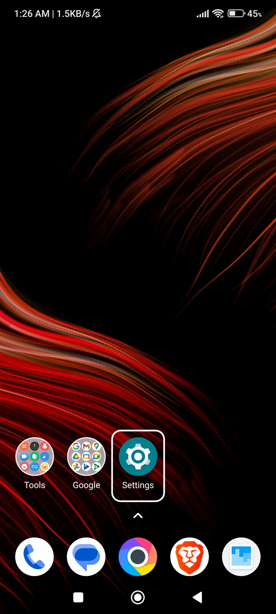
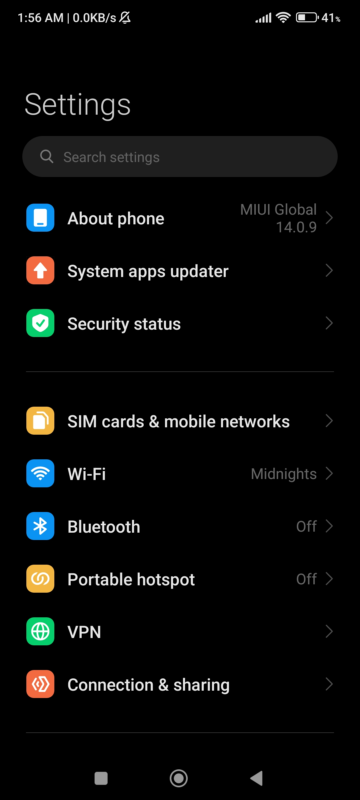
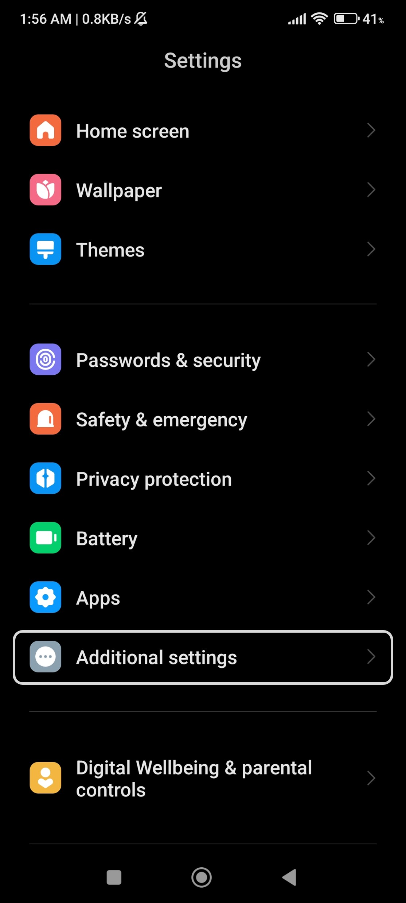
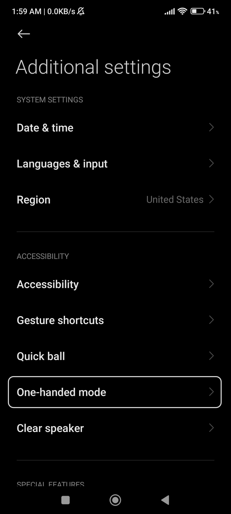
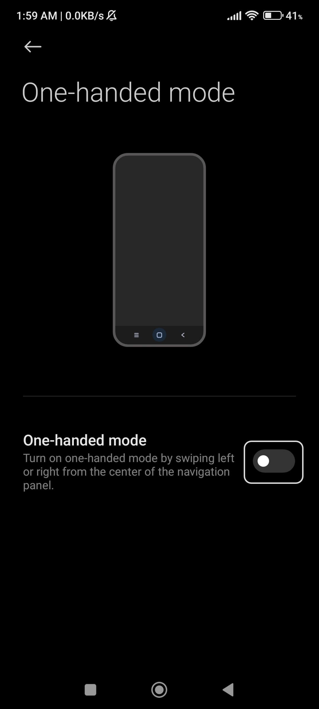
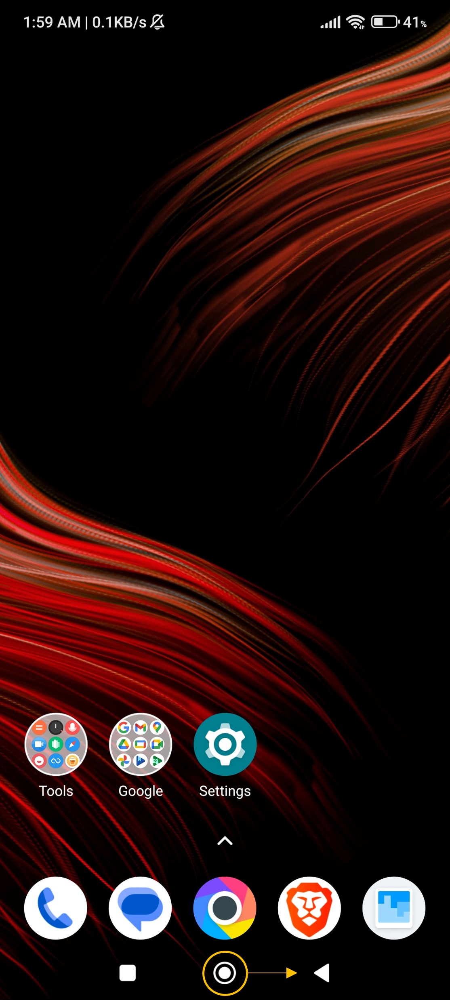
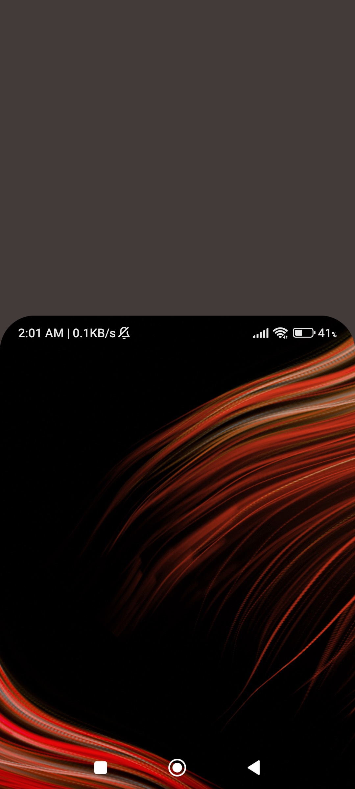
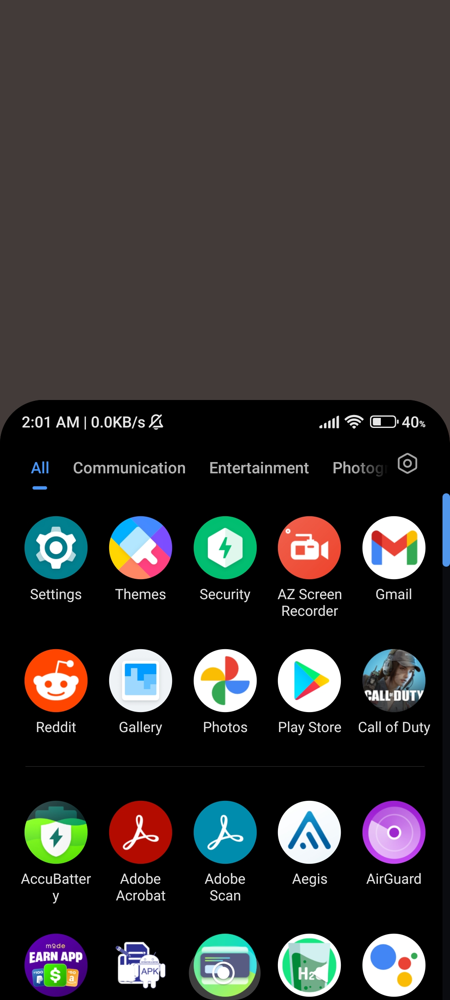
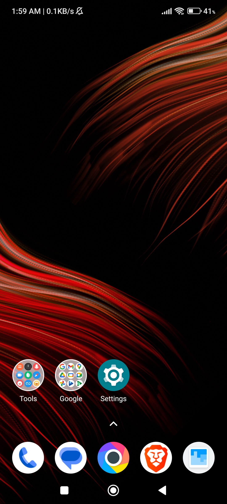

# One Handed Mode

Let's say you are standing in a crowded train, getting back home from work. Suddenly, you remeber today is the deadline for the credit card bill payment and you want to pay right now. You get your phone out and as phones are quite big these days, it's a bit difficult to use it with one hand. You have do quite some 'finger gymnastics' to reach the corners of the display. 

However, in such scenarios, you can use one-handed mode to shrink the screen content so that everywhere on the sceern is easily reachable. You can enable this mode in just a couple of clicks.

First, go to the Settings menu by either clicking on the gear icon or scrolling down on your home screen and clicking on the top right hand corner.

  

After opening settings, scroll down until you find 'Additional Settings' and click on it.

  

Now click on 'One Handed Mode' and then click on the toggle (shown in the right image below) to enable the mode.

  

From now on, anytime you need to shrink the screen so that everywhere is reachable by your thumb, just swipe to the right from the home button on your screen.

  

As you can see in the left image below, everything on the screen now fits in the bottom half of the screen. To exit one handed mode, just click anywhere in the brown region and the display will go back to full screen.

  
